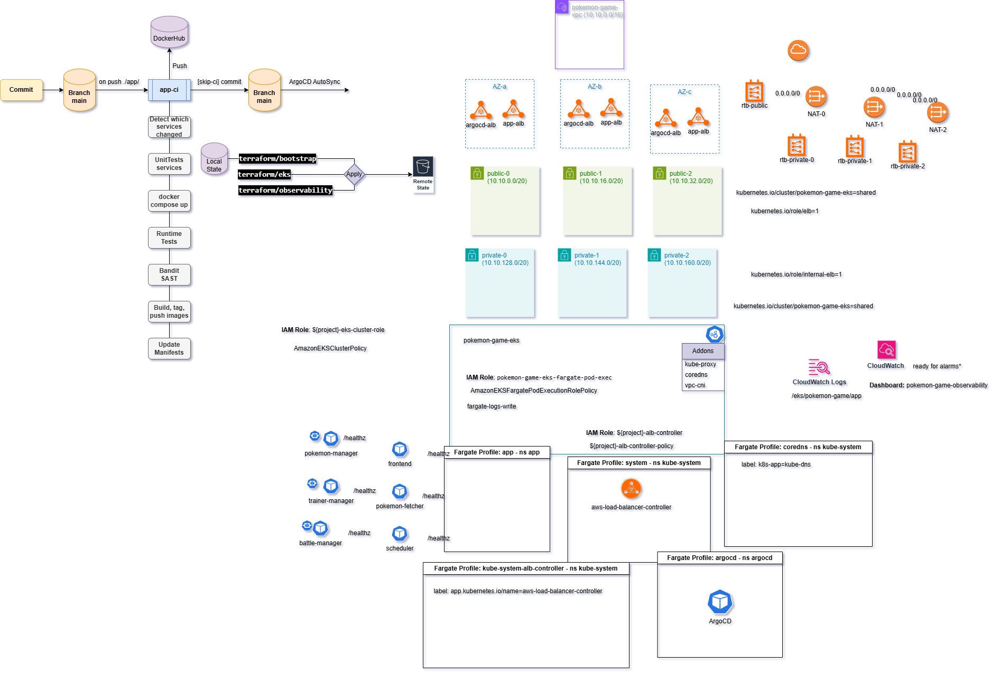

# DevSecOps: Pokemon Game Architecture
[](https://github.com/s1natex/Pokemon_Game/actions/workflows/app-ci.yml)
- ### [Project Screenshots](./docs/screenshots.md)
## Project Overview
- `Application`:
    - Each service runs as an independent container with a dedicated Service and Horizontal Pod Autoscaler
    - The frontend is exposed publicly via an Application Load Balancer
    - Backend services remain internal in private subnets
    - Services communicate over REST APIs through the internal VPC network
    - The app namespace uses a Fargate profile and service account for isolation and observability
- `Infrastructure & Networking`:
    - The infrastructure is built entirely with Terraform using a remote S3 backend and DynamoDB locking
    - VPC spans three Availability Zones (AZ-a, AZ-b, AZ-c) with public and private subnets per AZ
    - Public subnets host internet-facing ALBs and NAT Gateways
    - Private subnets host EKS workloads on Fargate
    - The EKS cluster runs add-ons like vpc-cni, kube-proxy, and coredns configured for Fargate
    - Segment workloads by namespace (app, kube-system, argocd, observability)
    - Public ALBs manage ingress for the frontend and ArgoCD
- `Storage & State Management`:
    - Terraform state is stored in an S3 bucket with versioning, encryption, and public access blocking
    - DynamoDB table provides state locking with the LockID attribute
    - S3 and DynamoDB resources are tagged for cost tracking
- `IAM & Security`:
    - IAM follows the principle of least privilege across all roles and policies
- `ArgoCD Deployment`:
    - ArgoCD runs inside its own namespace on Fargate
    - Deployed via Helm with autosync enabled to monitor the main branch on GitHub
    - A separate ALB ingress provides external access to the ArgoCD web UI
    - The ArgoCD controller has a cluster-admin role binding limited to the argocd namespace
- `CI Pipeline`:
    - On commit, the workflow runs pytest unit and runtime tests, and SAST security scans using Bandit
    - Each service is containerized and tagged dynamically (`SERVICE-DATE-TIME-SHA`), and pushed to DockerHub
    - The workflow commits updated image tags to the repository with a `[skip-ci]` flag triggering ArgoCD autosync
- `Observability & Monitoring`:
    - CloudWatch provides centralized monitoring and logging
    - All EKS pods stream logs to CloudWatch Logs via the `fargate-logs-write` IAM policy
    - CloudWatch dashboard visualizes ALB metrics:
        - RequestCount
        - TargetResponseTime
        - Error by service
        - Recent error log lines
        - endpoint traffic
        - health checks
- `Scripts & Automation`: Python automation scripts manage deployment, validation, monitoring, and teardown
## Improvement
- Add AWS SNS/SQS for the event-driven layer
- Add autoscaling metrics and CloudWatch alarms for EKS scaling behavior
- 50,000 concurrent users needs validation
- Add an external IdP dummy for trainer authentication(AWS Cognito)
- Add HTTPS for ALB
- Experiment implementing mTLS pod to pod communication with Istio
- Create CI/CD for Terraform with Destroy Workflow
## Project Diagram

## Prerequisites
  - `Python3`
  - `Terraform`
  - `Kubectl`
  - `Git`
  - `Git Bash`
  - `AWS-CLI`
  - AWS local pc credentials set as environment variables
  - `Docker Desktop`(local testing)
  - `Pytest`(local testing)
  - `git clone https://github.com/s1natex/Pokemon_Game`
## Setup Instructions
- ### Bootstrap for `S3 Remote state` and `OIDC`
```
# Bootstrap build is managed from local state file and the rest is stored in remote S3
cd ./terraform/bootstrap
terraform init
terraform plan
terraform Apply
```
- ### Launch the `EKS` Cluster
```
cd ./terraform/eks
```
- Create terraform/eks/terraform.tfvars
```
region             = "eu-central-1"
project            = "pokemon-game"
state_bucket       = "<use terraform output from bootstrap for bucket name>"
lock_table         = "pokemon-game-tf-locks"
cluster_name       = "pokemon-game-eks"
```
- Run terraform init with the new bucket name
```
terraform init -reconfigure \
-backend-config="bucket=<use terraform output from bootstrap for bucket name>" \
-backend-config="key=eks/terraform.tfstate" \
-backend-config="region=eu-central-1" \
-backend-config="dynamodb_table=pokemon-game-tf-locks"
```
- Run Plan to validate correct infrastructure and apply
```
terraform plan
terraform apply

# Cluster Deployment takes about 10-15 minutes to fully deploy
```
- Verify the Cluster is up
```
aws eks update-kubeconfig \
  --name pokemon-game-eks \
  --region eu-central-1 \
  --alias pokemon-game-eks
kubectl config use-context pokemon-game-eks
kubectl get nodes
kubectl -n kube-system get deploy aws-load-balancer-controller
kubectl -n app get pods,svc,ingress
```
- ### Deploy the Cluster using a Python script from project root
```
python3 ./scripts/eks-k8s-deploy.py
```
- ### Deploy `Monitoring and Logging`
```
cd ./terraform/observability/
```
- Run init with the new bucket name
```
terraform init -reconfigure \
-backend-config="bucket=<use terraform output from bootstrap for bucket name>" \
-backend-config="key=observability/terraform.tfstate" \
-backend-config="region=eu-central-1" \
-backend-config="dynamodb_table=pokemon-game-tf-locks"
```
- Create terraform/observability/terraform.tfvars
```
region             = "eu-central-1"
project            = "pokemon-game"
state_bucket       = "<use terraform output from bootstrap for bucket name>"
lock_table         = "pokemon-game-tf-locks"
cluster_name       = "pokemon-game-eks"
alb_arn_suffix = "<use the command below for value>"
```
- `alb_arn_suffix` value command
```
export MSYS_NO_PATHCONV=1
export MSYS2_ARG_CONV_EXCL="*"
REGION="eu-central-1"

aws elbv2 describe-load-balancers --region "$REGION" \
  --query 'LoadBalancers[?Type==`application`].LoadBalancerArn' --output text \
| sed -E 's|^arn:aws:elasticloadbalancing:[^:]+:[0-9]+:loadbalancer/||'
```
- Run Plan to validate correct infrastructure and apply
```
terraform plan
terraform apply
```
- Patch Cloudwatch and Cloudwatch Logs from project root
```
python3 ./scripts/cloudwatch-patch.py
```
## Validation Checklist
- ### Grab `Frontend` address and access via browser
```
kubectl -n app get ingress app-alb
```
- ### Access `CloudWatch` and `CloudWatch Logs`
```
# Logs appear under CloudWatch Logs -> /eks/pokemon-game/app
# Dashboard: CloudWatch -> Dashboards -> pokemon-game-observability
```
- ### Run `populate_dashboard.py` to simulate traffic to the cluster, run from project root
```
# Script asks for frontend address
python3 ./scripts/populate_dashboard.py
```
- ### Access and Login to `ArgoCD` UI
```
# Address
kubectl -n argocd get ingress argocd-alb -o jsonpath='{.status.loadBalancer.ingress[0].hostname}{"\n"}'

# Username: admin

# Password:
kubectl -n argocd get secret argocd-initial-admin-secret -o jsonpath="{.data.password}" | base64 -d && echo
```
- ### `CI/CD` Testing
    - If using fork Update `DOCKERHUB_TOKEN` and `DOCKERHUB_USERNAME` in Repository actions -> secrets
    - Make some changes to `./app/` dir
    - `Commit` and `push` to GitHub Repository
    - CI will pick up and run `Unit` and `Runtime` tests via `Docker Compose`, `Bandit(SAST)` scan, `Build`, `Tag`(name-date-time-sha), `Push` to DockerHub and `commit back` to the Repository with `[skip-ci]` flag
    - `ArgoCD` will detect changes (default autosync every 3 minutes) and deploy the new images to the cluster using the default rolling deployment strategy
    - In this Project `Rollbacks` are possible manually by `deactivating autosync` and the `ArgoCD rollback feature` or using Git Revert and pushing the change to main
## Clean Up
- Destroy Monitoring build
```
cd ./terraform/observability/
terraform destroy
```
- Cleanup EKS Deployment from project root
```
python3 ./scripts/eks-k8s-destroy.py
```
- Destroy Terraform EKS build
```
cd ./terraform/eks
terraform destroy
```
- Empty S3 Bucket on AWS UI
- Destroy Bootstrap build
```
cd ./terraform/bootstrap
terraform destroy
```
- CLI Context switch
```
kubectl config use-context docker-desktop
kubectl config current-context
```
