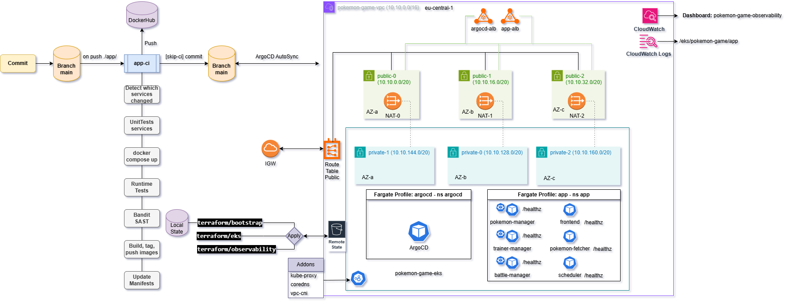

# DevSecOps: Pokemon Game Architecture

- ### [Setup Instructions](./docs/setup.md)
- ### [Screenshots](./docs/screenshots.md)
## Project Overview:
- Dummy app only with critical functionalities
- `FRONTEND`: FastAPI exposed via AWS ALB Ingress
- `BACKEND`: Independent FastAPI microservices
    - Pokémon Manager: CRUD management of Pokémon entities
    - Trainer Manager: handles trainer profiles and operations
    - Battle Manager: simulates and records Pokémon battles
    - Scheduler: coordinates asynchronous jobs for other services
    - Pokémon Fetcher: integrates with external APIs to enrich data
- `DATA FLOW`: RESTful APIs and internal event-based communication through asynchronous job scheduling
- `INFRASTRUCTURE`: Managed via Terraform with isolated modules:
  - **terraform/bootstrap**: S3 state bucket and DynamoDB lock table
  - **terraform/eks**: EKS cluster, Fargate profiles, networking
  - **terraform/observability**: CloudWatch and FluentBit logging
- `CI/CD`:
  - `app-ci`: runs on code changes under `./app/`
    - Unit & runtime tests via pytest
    - Security scans with Bandit (SAST)
    - Dynamic image tagging - `SERVICE_NAME-DDMMYYYY-HHMM-SHA`
    - Auto-updates Kubernetes manifests with new image tags
  - `DEPLOYMENT`: ArgoCD manages application lifecycle, syncing manifests from GitHub to Kubernetes
- `Observability`:
  - CloudWatch logs and metrics enabled via namespace labeling
  - Centralized metrics dashboard via Prometheus-compatible exporters
  - Automated patching script ensures logging and metrics connectivity
- `SECURITY & COMPLIANCE`:
    - Principle of Least Privilege enforced via IAM roles
    - Secure state management (S3 with encryption + DynamoDB locks)
    - Bandit SAST integrated into CI for code vulnerability detection
    - ALB ingress with controlled namespace-level access for `Frontend` and `ArgoCD`
- `PERFORMANCE & SCALABILITY`: The system is architected to handle up to 50,000 concurrent users
    - EKS-managed horizontal scaling per deployment
    - Load balancing via AWS ALB
    - Fargate auto-provisioning for stateless workloads
    - Minimal inter-service coupling allowing independent scaling
    - Terraform modules enable easy environment replication
    - Stress Test included to stimulate requests, events and errors
- #### Future Implementations:
    - Integration of branch protection with app and infra CI/CD overhaul
    - Change to EKS on EC2 (Graviton spot mix) for lower costs
    - Integrate SNS/SQS within AWS network for secure internal comms
    - Integrate Identity Provider (IdP)
    - Integrate Message Broker (Event-Driven)
    - Redraw Diagram to correctly represent the project in detail
## Project Diagram:
- Note: Diagram is raw and incomplete

## Design Choices Overview:
- #### The design prioritizes Operational overhead, modularity, automation, and observability
- #### Application:
    - Each service runs as an independent FastAPI container, the idea was to decouple each service to achieve easy scaling and maintainability
    - REST-based communication keeps interoperability simple without requiring external brokers
    - Keeping the design of each service decoupled and modular achieves Kubernetes orchestration and ArgoCD GitOps deployment
    - Images stored in DockerHub for the MVP but a migration to ECR is easily implemented if rate limits are applied
- #### Infrastructure:
    - AWS EKS chosen for managed Kubernetes, reducing control plane complexity and plug and play orchestration
    - Each service runs on AWS Fargate for cost efficiency and automatic compute scaling
    - EKS Fargate is the MVP solution but for a more realistic approach and cheaper costs using EKS + EC2 graviton would lower costs by 30% and is easy to achieve
    - My main goal was an mvp infrastructure with the lowest operational overhead possible than cost efficiency with open options for future cost optimizations
    - Terraform was used in combo with local state for bootstrap and remote for the actual infrastructure
    - I used Python for several QOL scripts
    - EKS HPS + Stateless service model supports 50k+ concurrent sessions under load
    - namespace separation (app, argocd, aws-observability) maintains security boundaries
- #### Monitoring and Logging:
    - Native AWS CloudWatch integrated as the centralized monitoring solution ready for future alarms and notifications
    - FluentBit DaemonSet forwards container logs to CloudWatch log groups
    - Prometheus-compatible metrics exported via FastAPI endpoints (`/metrics`)
    - ArgoCD provides deployment insights and app synchronization status
    - Centralized Logging implemented using cloudwatch Logs ready for audits and use
- #### CI/CD:
    - app-cd workflow and argocd operator in the cluster for seamless application level cicd
    - Terraform cicd was skipped due to auth and pipeline flow problems, will be ovehauled in the future
    - GitHub Actions was chosen as the ci due to my use of github without need for additional infrastructure and can be expanded with cost reduction using self hosted runners
