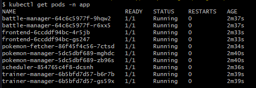
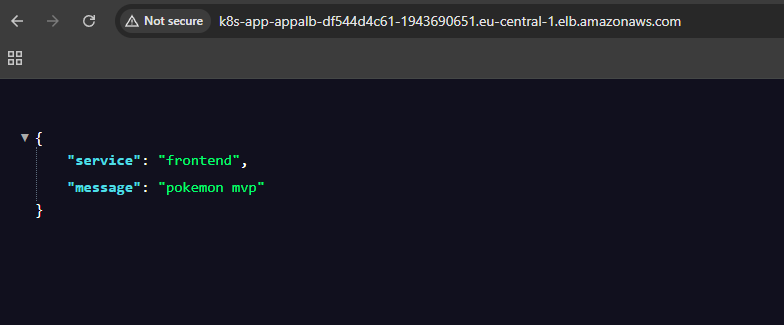
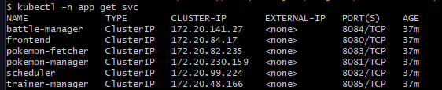
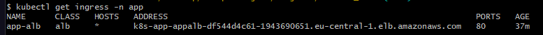
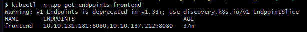
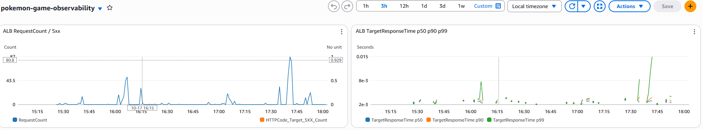
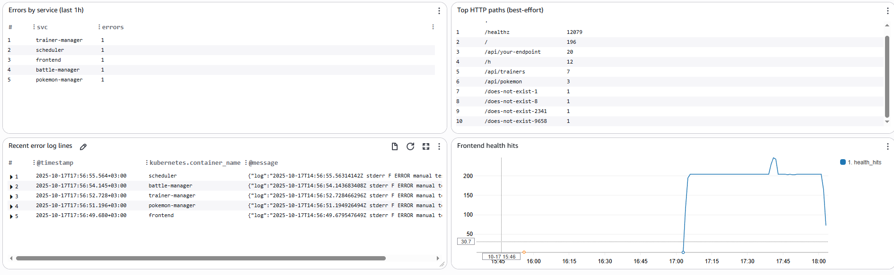
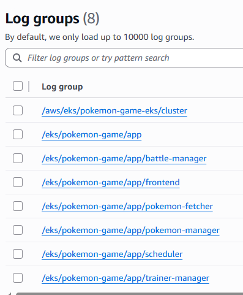
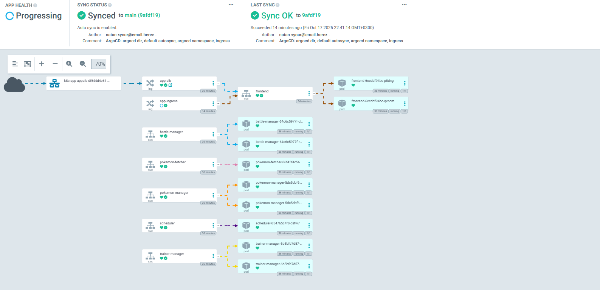
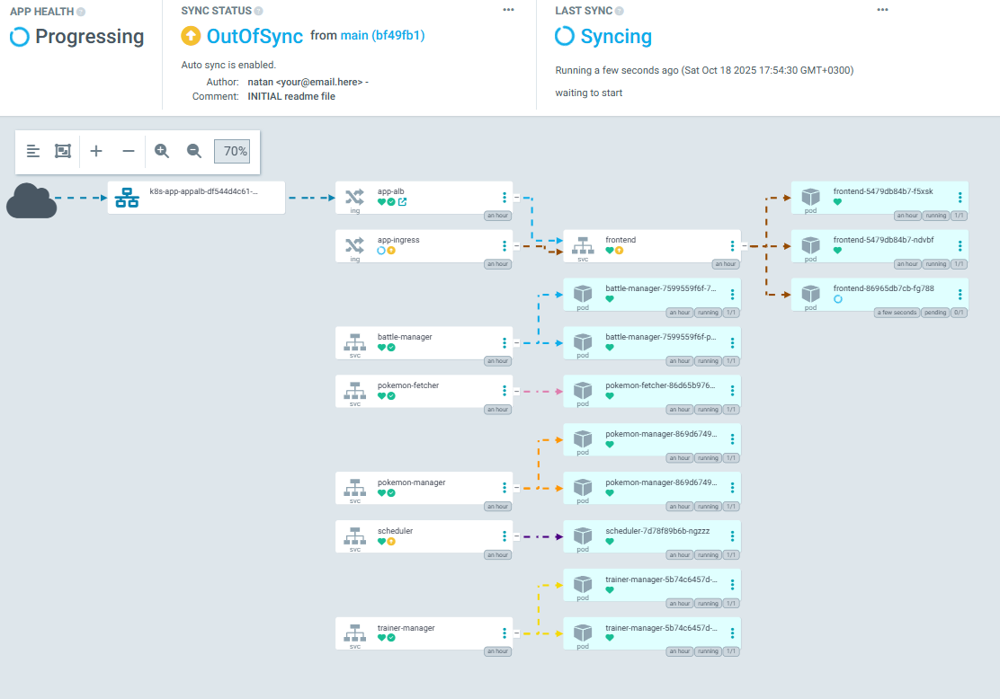

# Screenshot Validation
### - EKS Pods Running:

### - Simple Frontend Dummy:

### - Pod to Pod communication solution using ClusterIP

### - Frontend as single point of entry(argocd also for mvp demo)

### - Cloudwatch and Cloudwatch Logs

### - ArgoCD Dashboard

### - ArgoCD Dashboard auto syncing

